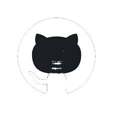
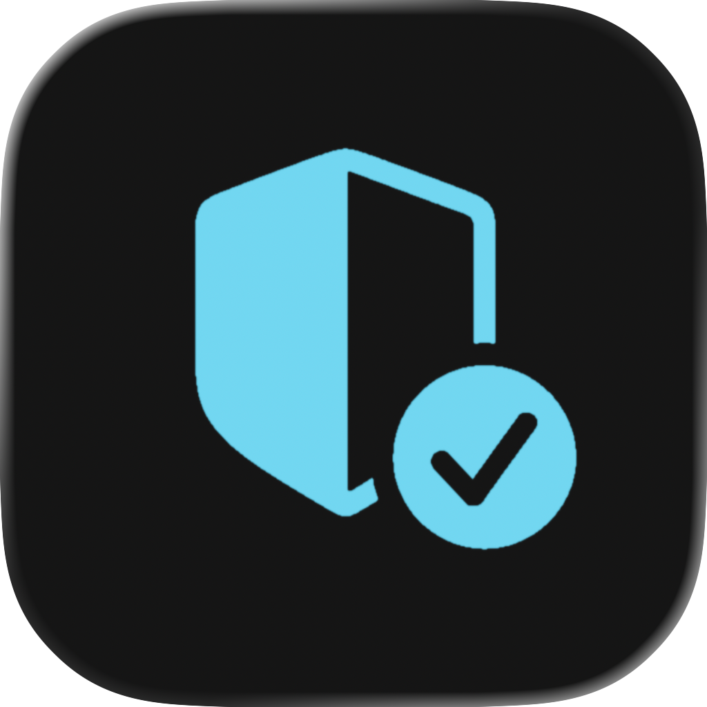
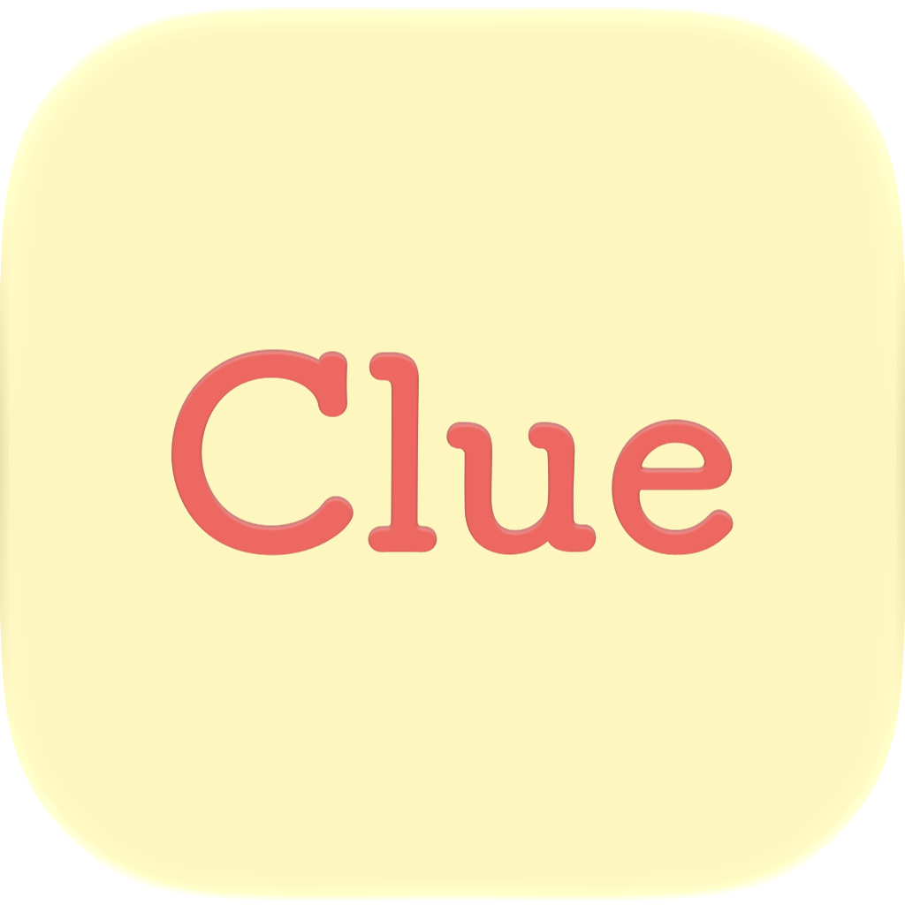

<!DOCTYPE html>
<html lang="en">
<head>
  <meta charset="UTF-8" />
  <meta name="viewport" content="width=device-width, initial-scale=1.0" />

  <title>Wed Alasiri | Portfolio</title>

  <link rel="preconnect" href="https://fonts.googleapis.com">
  <link rel="preconnect" href="https://fonts.gstatic.com" crossorigin>

  <link
    href="https://fonts.googleapis.com/css2?family=Inter:wght@300;400;500;600;700&display=swap"
    rel="stylesheet"
  >

  
</head>

<body>

  <button id="langToggle" class="lang-btn">
    AR
  </button>

  <main class="container">

    <!-- =========================
         HERO
    ========================== -->

    <section class="grid grid-2">

      

        <h1>
          HI, I’m Wed Alasiri
        </h1>

        

          Software Engineer | Cybersecurity | iOS Developer
        

        

         Two years of hands-on experience gained through real-world projects, industry internships, and specialized training in software engineering, iOS development, and cybersecurity. Focused on building secure, scalable, and user-focused software.

        

      

      

        

          

        

      

    </section>

    <!-- =========================
         CONTACT
    ========================== -->

    <section class="grid grid-3">

      

        <h3>
          Contact
        </h3>

        

          Email: wed.alasiri2025@gmail.com
        

        

          Phone: +966 55 208 5766
        

        <button
          class="contact-btn"
          onclick="window.location.href='mailto:wed.alasiri2025@gmail.com'"
        >
          Send an Email
        </button>

        <button
          class="contact-btn"
          style="margin-top:12px;background:#2a2b31"
          onclick="window.open('cv/Wed-Alasiri-CV.pdf','_blank')"
        >
          View My CV
        </button>

      

      <!-- LINKEDIN -->

      

        

        
          Click to visit LinkedIn
        

      

      <!-- GITHUB -->

      

        

        
          Click to visit GitHub
        

      

    </section>

    <!-- =========================
         ABOUT
    ========================== -->

    <section class="card">

      <h2>
        ABOUT ME
      </h2>

      

        Software Engineer with practical experience building
        production-ready applications and AI-powered solutions
        through industry internships and real-world projects.
      

      

        Experienced in software development, application architecture,
        clean coding practices, and modern development methodologies,
        with a strong focus on delivering scalable, secure, and
        high-quality solutions.
      

      

        Complemented by hands-on cybersecurity experience in network
        security, vulnerability assessment, threat analysis,
        penetration testing, secure software development, and
        risk management.
      

      

        Continuously expanding expertise in cloud technologies and
        DevOps, including IaaS and PaaS, with a focus on integrating
        security throughout the software development lifecycle.
      

    </section>

    <!-- =========================
         SKILLS
    ========================== -->

    <section class="card">

      <h2 class="section-title">
        SKILLS
      </h2>

      

        <!-- CYBERSECURITY -->

        

          

            <h4>
              Cybersecurity
            </h4>

            

              Penetration Testing
              Vulnerability Assessment
              Threat Analysis
              Risk Assessment
              Network Security
              Application Security
              Secure Software Development
              Secure SDLC
              Incident Response
              Cryptography

            

          

          

            <h4>
              Network & Infrastructure
            </h4>

            

              TCP/IP
              DNS
              DHCP
              VPN
              Firewall
              IDS
              ACL

            

          

          

            <h4>
              Security Tools
            </h4>

            

              Kali Linux
              Metasploit
              Burp Suite
              OWASP ZAP
              Wireshark
              Nmap
              Splunk

            

          

        

        <!-- SOFTWARE / AI -->

        

          

            <h4>
              iOS & Software Engineering
            </h4>

            

              SwiftUI
              UIKit
              MVVM
              MVC
              REST APIs
              JSON
              Core Data
              UserDefaults
              Firebase
              Xcode
              Git
              GitHub
              API Integration
              Debugging
              Testing

            

          

          

            <h4>
              AI & Machine Learning
            </h4>

            

              Machine Learning
              Artificial Intelligence
              NLP
              Generative AI
              Model Development
              AI API Integration
              Core ML
              Create ML
              Recommendation Systems

            

          

          

            <h4>
              Cloud & DevOps
            </h4>

            

              DevOps Fundamentals
              Cloud Computing
              IaaS
              PaaS
              Docker
              AWS
              CI/CD

            

          

        

      

    </section>

    <!-- =========================
         EXPERIENCE
    ========================== -->

    <section class="card">

      <h2 class="section-title">
        PROFESSIONAL EXPERIENCE
      </h2>

      <!-- SAUDICO -->

      

        

          Cyber Security & Software Development Intern
        

        

          Saudi Constructioneers Ltd. (SAUDICO) |
          March 2026 – June 2026
        

        <ul>

          <li>
            Developed and integrated an attendance management
            system into the company's internal platform,
            improving operational efficiency and data accuracy.
          </li>

          <li>
            Worked across mobile development, backend integration,
            and cybersecurity projects within an enterprise environment.
          </li>

          <li>
            Conducted penetration testing and vulnerability
            assessments on web applications and networks using
            industry-standard security tools.
          </li>

          <li>
            Deployed an Intrusion Detection System (IDS) to monitor
            network traffic and detect suspicious activities.
          </li>

          <li>
            Configured firewalls, Access Control Lists (ACLs),
            and Site-to-Site VPN to strengthen network security.
          </li>

          <li>
            Built and managed core network services including
            TCP/IP, DHCP, and DNS.
          </li>

        </ul>

      

      <!-- MINISTRY -->

      

        

          Software Engineering Intern
        

        

          Ministry of Education |
          January 2024 – July 2024
        

        <ul>

          <li>
            Designed and developed a web-based platform for
            managing professional development activities.
          </li>

          <li>
            Improved database organization and reporting efficiency
            through optimized data structures and backend enhancements.
          </li>

        </ul>

      

    </section>

    <!-- =========================
         EDUCATION & TRAINING
    ========================== -->

    <section class="card">

      <h2 class="section-title">
        EDUCATION & TRAINING
      </h2>

      

        <!-- EDUCATION 1 -->

        

          

            

          

          

            <h3>
              Tuwaiq Academy
            </h3>

            
              Apple Developer Academy
            

          

        

        <!-- EDUCATION 2 -->

        

          

            

          

          

            <h3>
              Academy of Learning
            </h3>

            
              July 2026
            

          

        

        <!-- EDUCATION 3 -->

        

          

            

          

          

            <h3>
              Princess Nourah bint Abdulrahman University
            </h3>

            
              July 2024
            

          

        

      

    </section>

    <!-- =========================
         FEATURED PROJECTS
    ========================== -->

    <section class="card">

      <h2 class="section-title">
        FEATURED PROJECTS
      </h2>

      

        <!-- SAFETAP -->

        

          

          <h3>
            SafeTap
          </h3>

          

            AI-powered fraud detection application that helps
            detect fraudulent calls and messages in real time
            and explains the risk to the user.
          

          

            SwiftUI
            Core ML
            NLP
            Machine Learning
            Cybersecurity

          

          

            <a
              href="https://github.com/wedalasiri"
              target="_blank"
              class="project-btn secondary"
            >
              GitHub
            </a>

          

        

        <!-- JISR -->

        

          

          <h3>
            Jisr | Community Integration Platform
          </h3>

          

            An iOS application that helps Saudi scholarship
            students connect with others through shared interests
            and community activities.
          

          

            SwiftUI
            Firebase
            Core ML
            OpenAI API
            3D

          

          

            <a
              href="https://apps.apple.com/sa/app/jisr/id6776704071"
              target="_blank"
              class="project-btn"
            >
              App Store
            </a>

            <a
              href="https://github.com/wedalasiri"
              target="_blank"
              class="project-btn secondary"
            >
              GitHub
            </a>

          

        

        <!-- CLUE -->

        

          

          <h3>
            Clue
          </h3>

          

            A decision-making app with two modes:
            Wisely for guided decisions and Randomly for
            instant picks when you can't decide.
          

          

            iOS
            Swift
            Team Project

          

        

        <!-- PRONOUNCEME -->

        

          

          <h3>
            PronounceMe
          </h3>

          

            An iOS application supporting individuals with
            Speech Sound Disorders through interactive
            speech exercises and continuous practice.
          

          

            iOS
            Swift
            Accessibility

          

        

        <!-- BOARD ROOM -->

        

          

          <h3>
            Board Room
          </h3>

          

            A secure SwiftUI room booking application with
            authentication and REST API integration.
          

          

            SwiftUI
            REST API
            Authentication
            Security

          

        

        <!-- JUTHOOR -->

        

          

          <h3>
            Juthoor | جذور
          </h3>

          

            An educational game that promotes Saudi heritage
            through interactive learning experiences,
            games, and regional cultural content.
          

          

            iOS
            Educational
            Game
            Saudi Culture

          

        

      

    </section>

    <!-- =========================
         CYBERSECURITY PROJECTS
    ========================== -->

    <section class="card">

      <h2 class="section-title">
        CYBERSECURITY LAB PROJECTS
      </h2>

      

        <!-- WEB SECURITY -->

        

          

          <h3>
            Web Vulnerability Analysis
          </h3>

          

            Conducted authorized web application security testing,
            traffic interception, passive scanning, request
            analysis, and security findings documentation.
          

          

            Burp Suite
            OWASP ZAP
            Web Security
            Vulnerability Assessment

          

        

        <!-- FIREWALL -->

        

          

          <h3>
            Secure Network Using Firewall & ACL
          </h3>

          

            Designed a secure network using firewall rules
            and Access Control Lists to control traffic
            between networks.
          

          

            Firewall
            ACL
            Network Security

          

        

        <!-- VPN -->

        

          

          <h3>
            Site-to-Site VPN
          </h3>

          

            Implemented encrypted VPN connectivity between
            remote networks using Cisco technologies.
          

          

            VPN
            Cisco
            Network Security

          

        

        <!-- TCP/IP -->

        

          

          <h3>
            Network Using TCP/IP, DHCP & DNS
          </h3>

          

            Built a network infrastructure based on TCP/IP
            protocols with automated address allocation
            through DHCP and DNS services.
          

          

            TCP/IP
            DHCP
            DNS
            Networking

          

        

      

    </section>

    <!-- =========================
         CERTIFICATIONS
    ========================== -->

    <section class="grid grid-2">

      

        <h3>
          Certifications
        </h3>

        

          Project Management Professional (PMP)
        

      

      

        <h3>
          Languages
        </h3>

        

          🇸🇦 Arabic &nbsp;&nbsp; 🇺🇸 English
        

      

    </section>

    <!-- =========================
         FINAL CONTACT
    ========================== -->

    <section class="card">

      <h2>
        LET'S CONNECT
      </h2>

      

        Interested in software engineering, iOS development,
        cybersecurity, AI, and building secure digital products.
      

      <button
        class="contact-btn"
        onclick="window.location.href='mailto:wed.alasiri2025@gmail.com'"
      >
        Get In Touch
      </button>

    </section>

    <!-- FOOTER -->

    <footer>
      © 2026 Wed Alasiri
    </footer>

  </main>

  <!-- =========================
       LANGUAGE BUTTON
  ========================== -->

  

</body>
</html>

